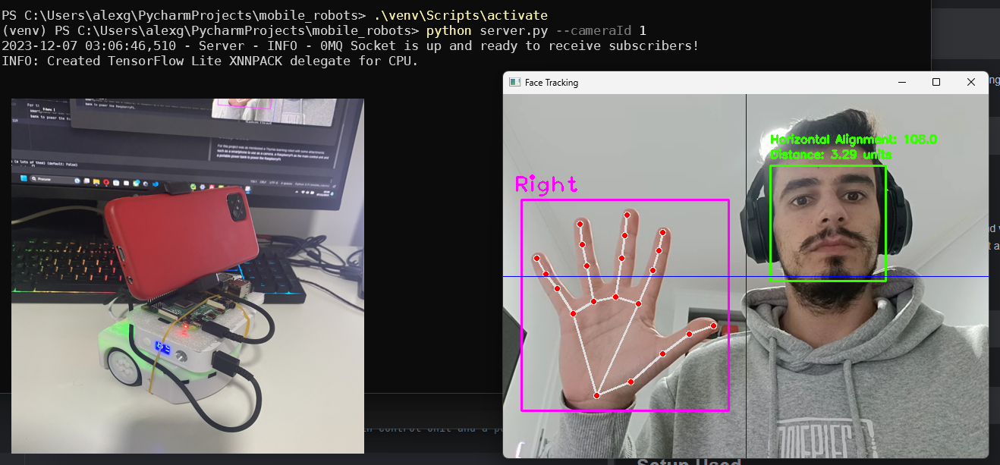

# Mobile Robots Project - Visual Servoring

This repository holds the source code for a final project developed in a Mobile Robots course in a Master's degree in IT at Faculdade de Ciências da Universidade de Lisboa.

## Table of Contents
- [Mobile Robots Project - Visual Servoring](#mobile-robots-project---visual-servoring)
  - [Table of Contents](#table-of-contents)
  - [Overview](#overview)
  - [Main Features](#main-features)
  - [Directory Structure](#directory-structure)
  - [Dependencies](#dependencies)
  - [Installation](#installation)
  - [Raspberry Services Setup](#raspberry-services-setup)
  - [Usage](#usage)
      - [Example for robot.py](#example-for-robotpy)
      - [Example for server.py](#example-for-serverpy)
  - [Setup Used](#setup-used)

## Overview

In this project, I have developed a comprehensive program for the Thymio robot, integrating concepts acquired through relevant courses. The primary focus includes implementing visual servoring control, odometry calculations for "precise as possible" robot tracking, and incorporating navigation and path planning functionalities.

I order to implement this features I have applied the following lectured concepts:
- Sensing
- Control
- Decision & Behaviours
- Software
- Locomotion
- Planning


Some of the previous topics were more explored than the other, but overall in this project there is a bit of every topic.

## Main Features
- **Visual Servoring Control**: The Thymio robot was equipped with a visual servoring system (in this case a smartphone), allowing it to intelligently respond to visual stimuli. This feature enhances the robot's ability to interact with its environment. Vision systems are way more powerfull and versatile than traditional optical sensors, allowing numerous types of interactions with the environment.
- **Odometry Calculations**: Odometry calculations have been implemented to provide real-time feedback on the robot's position and orientation. This information is crucial for control and navigation. In this project this odometry would go wrong really fast, which is normal because Thymio speed sensors have quite some error. This with more time could also be compensated by the vision system, fixing its position through elements in the environment.
- **Navigation and Path Planning**: The project incorporates navigation and path planning techniques. The robot can be told a point in a 2 axis plane, and it manages to navigate to that point through the odometry information. In this implementation the robot can only follow lines, but this could easily be change by getting some other path to connect to points.

## Directory Structure

In the following project directory there is two main python and a library called "utils".

```plaintext
- project-directory
    - robot.py
    - server.py
    - utils
        - __init__.py
        - pid.py
        - vision.py
        - auxils.py
```

- robot.py - This file is supposed to be executed in a machine connected to the robot. This script implements a client to control the robot, this cliente communicates with the server.
- server.py - This file can be executed in the same machine (if powerful enough) or can be executed in another machine across the network. This server uses a Vision Processor to handle image from the camera and sends processed data to the robot client. This data is face information (like coordinates and distance) and hand gestures.
- utils - Is a small library for this project where utilities are implemented.
- pid.py - This file holds the PIDController class. This class implements a very basic pid controller with a set of features specific to this project.
- vision.py - This file holds the VisionProcessor that is a multiprocessing Process, that can read image from a camera and uses opencv, cvzone and mediapipe to find faces and hands. This information is here processed and then sent through a pipe.
- auxils.py This file holds some general purpose classes and function like Point class, Pose class and a map function, for example.

## Dependencies

- thymiodirect - 0.1.2
- pyzmq - 25.1.2
- opencv-contrib-python - 4.8.1.78
- numpy - 1.26.2
- mediapipe - 0.10.2
- cvzone - 1.6.1

And some other sub dependencies.

## Installation

1. Clone the project and enter project folder.

```plaintext
git clone https://github.com/alexgeraldo/mobile-robots-project.git
cd mobile-robots-project
```

2. Optionally, create a virtual environment so there is no dependencies clash.

```plaintext
python -m venv venv
```

3. Activate virtual environment

```plaintext
# Linux/MacOS
source venv/bin/activate
```
```plaintext
# Windows
.\venv\Scripts\activate
```

4. Install the requirement by executing the following command. If something goes wrong, install dependencies in [Dependencies](#dependencies) chapter one by one.

```plaintext
pip install -r requirements.txt
```

## Raspberry Services Setup
To setup the services to start when the raspberry pi starts, run the below.
Add the service files under:
```
/etc/systemd/system/
```

Then run:
```shell
sudo systemctl daemon-reload
sudo systemctl enable start_stream.service
sudo systemctl start start_stream.service
sudo systemctl enable start_hotspot.service
sudo systemctl start start_hotspot.service
sudo systemctl enable start_robot.service
sudo systemctl start start_robot.service
```

## Usage

For more detail on how to user either *robot.py* or *server.py* run the command with -h (or --help) argument to check on what are the possible arguments and what are the required ones.

#### Example for robot.py

```plaintext
python robot.py --server_addr 192.168.0.10:5555 --debug
```

#### Example for server.py

```plaintext
python server.py --cameraId 1 --debug
```

## Setup Used

For this project was as mentioned a Thymio learning robot with some attachments such as a smartphone to use as a camera, a RaspberryPi 4 Model B as the main control unit and a portable power bank to power the RaspberryPi. Also used an external computer to act as server, because perfomance in the RaspberryPi for both face tracking and hand tracking was too slow for the real-time control requirements. To stream from the smartphone camera to the computer was used DroidCam.


*Photo of the prototype and vision server processing*